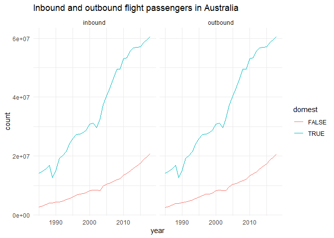
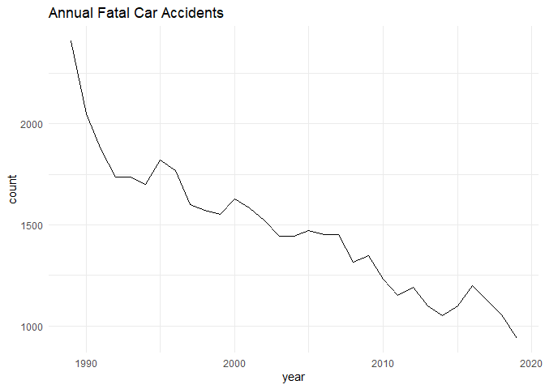
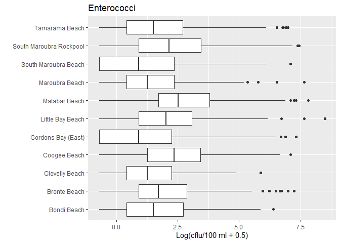
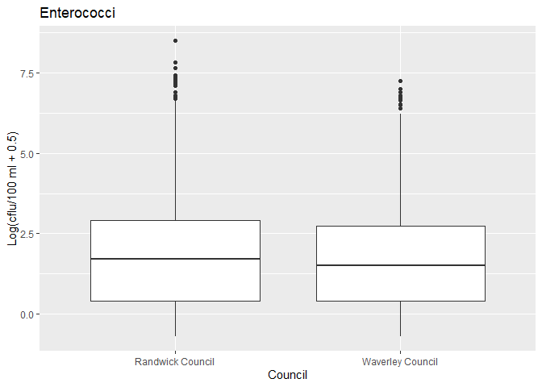
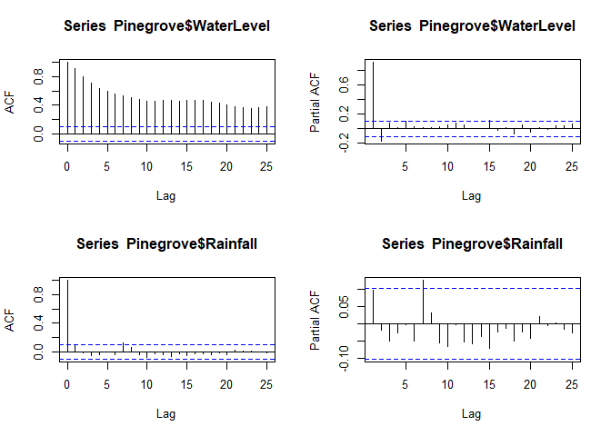
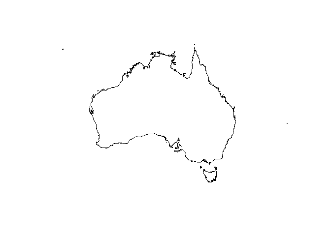

<div style="margin-bottom:50px;">

<script type="text/javascript">
$(document).ready(function() {
  $('#header').parent().prepend('<div id=\"logo\"></div>');
  $('#header').css('margin-right', '120px')
});
</script>


</div>

This repository was compiled at the rOpenSci OzUnconf19 @ University of Sydney, December 2019. 

Its purpose is to document datasets previously created at OzUnconf events, as well as other interesting and unique Australian datasets and resources. We have made our best attempt to have these links/packages functioning. However, in the case of errors still existing, an issue has been logged on Github. 

<div style="margin-bottom:50px;">
</div>

## Summary table
<!--html_preserve--><div id="htmlwidget-f83aec602527e5aac1c8" style="width:100%;height:auto;" class="datatables html-widget"></div>
<script type="application/json" data-for="htmlwidget-f83aec602527e5aac1c8">{"x":{"filter":"none","data":[["ozflights","ozroaddeaths","vehicles","beaches","river","birds","atlas","fires","bomrang","QOL enviro","CSIRO data","Ocean data","DataVic","ozbabynames","eechidna","ozdata","raustats","longitudinal","marriageequality","aflinfo","fitzRoy","cricketdata","ozmaps","ozdates","smokeybear","learningtower","hackerspace","indmortality","demdatabase"],["OzUnconf17","OzUnconf17","","R-Ladies Sydney","","","","","","","","","","OzUnconf18","OzUnconf16","OzUnconf17","","","","OzUnconf17","","OzUnconf17","","","OzUncon19","OzUncon19","","",""],["transport","transport","transport","environment","environment","environment","environment","environment","environment","environment","environment","environment","environment","demographics","demographics","demographics","demographics","demographics","demographics","sport","sport","sport","maps","misc","envionment","demographics","misc","demographics","demographics"],["package","package","link","link","link","link","link","link","package","links","links","links","links","package","package","package","package","link","link","package","package","package","package","package","package","package","links","package","package"],["Flight data","Road deaths","Vehicle use","Sydney beach data","River and rainfall data","Data about Australian birds","Atlas of Australian biodiversity","Bush fire data","access to BOM data","links to QLD environment and Maps data","CSIRO data portal, some behind confidentiality","Australian ocean data network","Access to enironmental and non environmental data from DataVic","Baby names in Australia","Election and census data","Australian economic data","Household survey","Longitudinal","Data from the 2017 marriage equality survey","AFL data","AFL data","Cricket data","Maps of Australia","Maps of Australia","Air quality datasets","PISA data","Access to data from hackerspace projects","Indigenous mortality data","Australian demographics data base"]],"container":"<table class=\"display\">\n  <thead>\n    <tr>\n      <th>Name<\/th>\n      <th>Origin<\/th>\n      <th>Topic<\/th>\n      <th>Package/Link<\/th>\n      <th>Data explanation<\/th>\n    <\/tr>\n  <\/thead>\n<\/table>","options":{"pageLength":20,"lengthMenu":[10,20,50],"order":[],"autoWidth":false,"orderClasses":false}},"evals":[],"jsHooks":[]}</script><!--/html_preserve-->

<div style="margin-bottom:50px;">
</div>

## Transport 


### Ozflights

Flight data from the Bureau of Infrastructure, Transport and Regional Economics [BITRE](https://www.bitre.gov.au/publications), downloaded using the [ozflights package](https://github.com/ropenscilabs/ozflights). See the documentation at https://github.com/ropenscilabs/ozflights. 


```r
#devtools::install_github("ropenscilabs/ozflights")
library(tidyverse)

passengers <- ozflights::airport_passengers()
freight <- ozflights::international_freight()
movements <- ozflights::aircraft_movements()
airports <- ozflights::airports()
distances <- ozflights::flightdistances()

passengers %>%
  filter(airport == "TOTAL AUSTRALIA") %>%
  ggplot(aes(x = year, y = count, group = domest, colour = domest)) +
  geom_line() + facet_wrap(~type) + theme_minimal() +
  ggtitle("Inbound and outbound flight passengers in Australia")
```

<!-- -->

```r
movements %>%
  filter(airport == "TOTAL AUSTRALIA") %>%
  ggplot(aes(x = year, y = count, group = domest, colour = domest)) +
  geom_line() + facet_wrap(~type) + theme_minimal() +
  ggtitle("Flight passenger movements in Australia")
```

<!-- -->

<br>

### Ozroaddeaths

Ozunconf18 produced a package to easily obtain this data (and did some cleaning). Check the [README](https://github.com/ropenscilabs/ozroaddeaths).


```r
devtools::install_github('ropenscilabs/ozroaddeaths')
```


```r
library(tidyverse)

crashes <- ozroaddeaths::oz_road_fatal_crash() 
fatalities <- ozroaddeaths::oz_road_fatalities() 

crash_plot <- ggplot(crashes, aes(x=year)) +
  geom_line(stat = "count") +
  theme_minimal() +
  ggtitle("Annual Fatal Car Accidents")

crash_plot
```

<!-- -->

<br>

### Vehicle use in Australia 2018

Data about motor vehicle use in Australia from the Australian Bureau of Statistics [link](https://www.abs.gov.au/ausstats/Subscriber.nsf/LookupAttach/9208.0Data+Cubes-20.03.191/$File/92080do001_1202201810.xls).

<div style="margin-bottom:50px;">
</div>

## Environmental


### Beach dataset

The beach data set is made available from [here](https://github.com/rladiessydney/RYouWithMe) 
with minimal documentation. You need to make sure you have installed the package *readr*.


```r
library(readr)
library(tidyverse)
library(ggplot2)
Syd_beach<-read_csv("https://raw.githubusercontent.com/rladiessydney/RYouWithMe/master/sydneybeaches.csv")
```

```
## Parsed with column specification:
## cols(
##   BeachId = col_double(),
##   Region = col_character(),
##   Council = col_character(),
##   Site = col_character(),
##   Longitude = col_double(),
##   Latitude = col_double(),
##   Date = col_character(),
##   `Enterococci (cfu/100ml)` = col_double()
## )
```

```r
Syd_beach
```

```
## # A tibble: 3,690 x 8
##    BeachId Region    Council   Site   Longitude Latitude Date  `Enterococci (cf…
##      <dbl> <chr>     <chr>     <chr>      <dbl>    <dbl> <chr>             <dbl>
##  1      25 Sydney C… Randwick… Clove…      151.    -33.9 02/0…                19
##  2      25 Sydney C… Randwick… Clove…      151.    -33.9 06/0…                 3
##  3      25 Sydney C… Randwick… Clove…      151.    -33.9 12/0…                 2
##  4      25 Sydney C… Randwick… Clove…      151.    -33.9 18/0…                13
##  5      25 Sydney C… Randwick… Clove…      151.    -33.9 30/0…                 8
##  6      25 Sydney C… Randwick… Clove…      151.    -33.9 05/0…                 7
##  7      25 Sydney C… Randwick… Clove…      151.    -33.9 11/0…                11
##  8      25 Sydney C… Randwick… Clove…      151.    -33.9 23/0…                97
##  9      25 Sydney C… Randwick… Clove…      151.    -33.9 07/0…                 3
## 10      25 Sydney C… Randwick… Clove…      151.    -33.9 25/0…                 0
## # … with 3,680 more rows
```

```r
str(Syd_beach)
```

```
## Classes 'spec_tbl_df', 'tbl_df', 'tbl' and 'data.frame':	3690 obs. of  8 variables:
##  $ BeachId                : num  25 25 25 25 25 25 25 25 25 25 ...
##  $ Region                 : chr  "Sydney City Ocean Beaches" "Sydney City Ocean Beaches" "Sydney City Ocean Beaches" "Sydney City Ocean Beaches" ...
##  $ Council                : chr  "Randwick Council" "Randwick Council" "Randwick Council" "Randwick Council" ...
##  $ Site                   : chr  "Clovelly Beach" "Clovelly Beach" "Clovelly Beach" "Clovelly Beach" ...
##  $ Longitude              : num  151 151 151 151 151 ...
##  $ Latitude               : num  -33.9 -33.9 -33.9 -33.9 -33.9 ...
##  $ Date                   : chr  "02/01/2013" "06/01/2013" "12/01/2013" "18/01/2013" ...
##  $ Enterococci (cfu/100ml): num  19 3 2 13 8 7 11 97 3 0 ...
##  - attr(*, "spec")=
##   .. cols(
##   ..   BeachId = col_double(),
##   ..   Region = col_character(),
##   ..   Council = col_character(),
##   ..   Site = col_character(),
##   ..   Longitude = col_double(),
##   ..   Latitude = col_double(),
##   ..   Date = col_character(),
##   ..   `Enterococci (cfu/100ml)` = col_double()
##   .. )
```

```r
Syd_beach$Site %>% unique
```

```
##  [1] "Clovelly Beach"          "Coogee Beach"           
##  [3] "Gordons Bay (East)"      "Little Bay Beach"       
##  [5] "Malabar Beach"           "Maroubra Beach"         
##  [7] "South Maroubra Beach"    "South Maroubra Rockpool"
##  [9] "Bondi Beach"             "Bronte Beach"           
## [11] "Tamarama Beach"
```

```r
Syd_beach$Region %>% unique
```

```
## [1] "Sydney City Ocean Beaches"
```

```r
Syd_beach$Council %>% unique
```

```
## [1] "Randwick Council" "Waverley Council"
```

```r
p1<-qplot(Syd_beach$Site,log(Syd_beach$`Enterococci (cfu/100ml)`+0.5),data=Syd_beach,geom=c("boxplot"),main="Enterococci",xlab="",ylab="Log(cflu/100 ml + 0.5)")
p1+coord_flip()
```

<!-- -->

```r
qplot(Syd_beach$Council,log(Syd_beach$`Enterococci (cfu/100ml)`+0.5),data=Syd_beach,geom=c("boxplot"),main="Enterococci",xlab="Council",ylab="Log(cflu/100 ml + 0.5)")
```

<!-- -->

<br>

### Environmental river flows
 
We are going to investigate the relationship between the Murray River average daily water level in metres (WaterLevel) and daily rainfall in mm at Pinegrove on the Murray River (Rainfall) available in the file *PineGrove19Aug19.csv*. It is reasonable to assume that the average daily water level is influenced by rainfall. This data covers the time period from 20 August 2018 to 19 August 2019. This data was extracted from [here](https://riverdata.mdba.gov.au/pinegrove) on 20 August 2019. Other locations could be extracted from [here](https://riverdata.mdba.gov.au/). Only the most recent year of data can be extracted.


```r
library(graphics)
Pinegrove<-read_csv("PineGrove19Aug19.csv")
```

```
## Parsed with column specification:
## cols(
##   Date = col_character(),
##   WaterLevel = col_double(),
##   Discharge = col_double(),
##   Rainfall = col_double()
## )
```

```r
Pinegrove
```

```
## # A tibble: 365 x 4
##    Date            WaterLevel Discharge Rainfall
##    <chr>                <dbl>     <dbl>    <dbl>
##  1 20/08/2018 9:00       1.56       897      1.2
##  2 21/08/2018 9:00       1.49       768      0.2
##  3 22/08/2018 9:00       1.48       753      0  
##  4 23/08/2018 9:00       1.53       839      0  
##  5 24/08/2018 9:00       1.48       758      0  
##  6 25/08/2018 9:00       1.43       665      0  
##  7 26/08/2018 9:00       1.40       625      4  
##  8 27/08/2018 9:00       1.40       620      0  
##  9 28/08/2018 9:00       1.38       596      0  
## 10 29/08/2018 9:00       1.36       552      0  
## # … with 355 more rows
```

```r
par(mfrow=c(1,2))
plot.ts(Pinegrove$WaterLevel)
plot.ts(Pinegrove$Rainfall)
```

<!-- -->

```r
require(graphics)
par(mfrow=c(2,2))
acf(Pinegrove$WaterLevel)
pacf(Pinegrove$WaterLevel)
acf(Pinegrove$Rainfall)
pacf(Pinegrove$Rainfall)
```

<!-- -->

```r
par(mfrow=c(1,1))
 ccf(Pinegrove$WaterLevel, Pinegrove$Rainfall, ylab = "Cross-correlation")
```

<!-- -->

<br>

### Birds datasets

Various datasets about Austrlian birds are [here](https://birdata.birdlife.org.au/).

<br>

### Atlas of living Australia 

Search occurrence records in the ALA by species, taxon, dataset, region, date, location, data provider…
Access the data [here](https://www.ala.org.au/).

<br>

### Bush Fires data 

Download Near real-time MODIS (C6) and VIIRS (375 m) active fire data.
Access the data [here](https://firms.modaps.eosdis.nasa.gov/active_fire/).

<br>

### Bureau of Meteorology data

The r package *bomrang* [here](https://cran.r-project.org/web/packages/bomrang/bomrang.pdf) has functions that extract Australian Government Bureau
of Meteorology ('BOM') data.

<br>

### Queensland Government environmental maps and data online

Environment data is available from links on [here](https://environment.des.qld.gov.au/resources/maps-imagery-data/online).

<br>

### CSIRO Data Access Portal

Some of the data sets from [here](https://data.csiro.au/dap/browse) are not restricted access.

<br>

### Australian Ocean Data Network (AODN) Open Access to Ocean Data

Marine and climate science data can be accessed from  [here](https://portal.aodn.org.au/).

<br>

### Australian fur seal (Brown fur seal) colonies in Victorian marine waters and adjacent Tasmanian waters

This can be ordered free from  [here](https://discover.data.vic.gov.au/dataset/australian-fur-seal-brown-fur-seal-colonies-in-victorian-marine-waters-and-adjacent-tasmanian-w) which comes from *DataVic* which is the place to discover and access Victorian Government open data. See [here](https://data.vic.gov.au/) for access to other data sets. 

<br>

### Smokeybear

Participants at rOpenSci OzUnconf19 developed a package on the air quality in NSW - daily average AQI in NSW from 2014-2019. 


```r
devtools::install_github("ropenscilabs/smoky")
```


<div style="margin-bottom:50px;">
</div>

## Demographics


### ozbabynames 

This dataset contains summary data for popular Australian baby names by sex, state and year. 


```r
#devtools::install_github("ropenscilabs/ozbabynames")
```


```r
library(ozbabynames)
str(ozbabynames)
```

```
## Classes 'tbl_df', 'tbl' and 'data.frame':	252358 obs. of  5 variables:
##  $ name : chr  "Charlotte" "Olivia" "Ava" "Amelia" ...
##  $ sex  : chr  "Female" "Female" "Female" "Female" ...
##  $ year : int  2017 2017 2017 2017 2017 2017 2017 2017 2017 2017 ...
##  $ count: int  577 550 464 442 418 392 378 353 351 339 ...
##  $ state: chr  "New South Wales" "New South Wales" "New South Wales" "New South Wales" ...
```

This dataset was created at rOpenSci OzUnconf 2019. Repo: [ozbabynames](https://github.com/ropenscilabs/ozbabynames)

<br>

### eechidna

This package contains datasets from the Australian Federal elections in 2001, 2004, 2007, 2010, 2013 and 2016, along with the Australian Census information for each House of Representatives electorate from the 2001, 2006, 2011 and 2016 Censuses. Additionally, Census information is imputed for electorates in years 2004, 2007, 2010 and 2013.


```r
devtools::install_github("ropenscilabs/eechidna")
```

<br> 

#### Australian Federal Elections Datasets


```r
str(eechidna::fp01)
```

```
## 'data.frame':	1039 obs. of  9 variables:
##  $ UniqueID  : num  801 801 801 801 801 801 802 802 802 802 ...
##  $ StateAb   : chr  "ACT" "ACT" "ACT" "ACT" ...
##  $ DivisionNm: chr  "CANBERRA" "CANBERRA" "CANBERRA" "CANBERRA" ...
##  $ Surname   : chr  "COX" "BARNIER" "ELLIS" "MILLER" ...
##  $ GivenNm   : chr  "BARRY" "BELINDA" "ANNETTE" "JOHN" ...
##  $ PartyAb   : chr  "ON" "LP" "ALP" "CTA" ...
##  $ Elected   : chr  "N" "N" "Y" "N" ...
##  $ Percent   : num  3.17 34.04 46.48 2 6.25 ...
##  $ PartyNm   : chr  "ONE NATION" "LIBERAL PARTY" "AUSTRALIAN LABOR PARTY" "CHRISTIAN DEMOCRATIC PARTY" ...
```

```r
str(eechidna::fp04)
```

```
## Classes 'tbl_df', 'tbl' and 'data.frame':	1091 obs. of  12 variables:
##  $ UniqueID      : num  801 801 801 801 801 802 802 802 802 802 ...
##  $ StateAb       : chr  "ACT" "ACT" "ACT" "ACT" ...
##  $ DivisionNm    : chr  "CANBERRA" "CANBERRA" "CANBERRA" "CANBERRA" ...
##  $ BallotPosition: num  1 2 3 4 5 1 2 3 4 5 ...
##  $ CandidateID   : num  15421 15166 14298 15360 15158 ...
##  $ Surname       : chr  "ELLERMAN" "BARNIER" "ARNOLD" "ELLIS" ...
##  $ GivenNm       : chr  "SUE" "BELINDA" "JIM" "ANNETTE" ...
##  $ PartyAb       : chr  "GRN" "LP" "CEC" "ALP" ...
##  $ PartyNm       : chr  "THE GREENS" "LIBERAL PARTY" "CITIZENS ELECTORAL COUNCIL" "AUSTRALIAN LABOR PARTY" ...
##  $ Elected       : chr  "N" "N" "N" "Y" ...
##  $ OrdinaryVotes : num  10243 37238 765 50214 2218 ...
##  $ Percent       : num  10.17 36.99 0.76 49.88 2.2 ...
```

```r
str(eechidna::fp07)
```

```
## Classes 'tbl_df', 'tbl' and 'data.frame':	1054 obs. of  13 variables:
##  $ UniqueID       : num  801 801 801 801 802 802 802 802 802 802 ...
##  $ StateAb        : chr  "ACT" "ACT" "ACT" "ACT" ...
##  $ DivisionNm     : chr  "CANBERRA" "CANBERRA" "CANBERRA" "CANBERRA" ...
##  $ BallotPosition : num  1 2 3 4 1 2 3 4 5 6 ...
##  $ CandidateID    : num  17277 18175 17614 17310 17431 ...
##  $ Surname        : chr  "BRESNAN" "COLBERT" "ELLIS" "HOLDER" ...
##  $ GivenNm        : chr  "AMANDA" "NATALIE" "ANNETTE" "JOHN" ...
##  $ PartyAb        : chr  "GRN" "LP" "ALP" "CEC" ...
##  $ PartyNm        : chr  "THE GREENS" "LIBERAL PARTY" "AUSTRALIAN LABOR PARTY" "CITIZENS ELECTORAL COUNCIL" ...
##  $ Elected        : chr  "N" "N" "Y" "N" ...
##  $ HistoricElected: chr  "N" "N" "Y" "N" ...
##  $ OrdinaryVotes  : num  14878 40359 58711 953 2509 ...
##  $ Percent        : num  12.95 35.13 51.1 0.83 2.31 ...
```

```r
str(eechidna::fp10)
```

```
## Classes 'tbl_df', 'tbl' and 'data.frame':	849 obs. of  13 variables:
##  $ UniqueID       : num  801 801 801 802 802 802 802 101 101 101 ...
##  $ StateAb        : chr  "ACT" "ACT" "ACT" "ACT" ...
##  $ DivisionNm     : chr  "CANBERRA" "CANBERRA" "CANBERRA" "FRASER" ...
##  $ BallotPosition : num  1 2 3 1 2 3 4 1 2 3 ...
##  $ CandidateID    : num  20863 20864 21228 20858 21307 ...
##  $ Surname        : chr  "JONES" "ELLERMAN" "BRODTMANN" "MILLIGAN" ...
##  $ GivenNm        : chr  "GIULIA" "SUE" "GAI" "JAMES KEITH" ...
##  $ PartyAb        : chr  "LP" "GRN" "ALP" "LP" ...
##  $ PartyNm        : chr  "LIBERAL PARTY" "THE GREENS" "AUSTRALIAN LABOR PARTY" "LIBERAL PARTY" ...
##  $ Elected        : chr  "N" "N" "Y" "N" ...
##  $ HistoricElected: chr  "N" "N" "N" "N" ...
##  $ OrdinaryVotes  : num  41732 20816 49608 36148 2175 ...
##  $ Percent        : num  37.21 18.56 44.23 32.41 1.95 ...
```

```r
str(eechidna::fp13)
```

```
## Classes 'tbl_df', 'tbl' and 'data.frame':	1188 obs. of  13 variables:
##  $ UniqueID       : num  801 801 801 801 801 801 802 802 802 802 ...
##  $ StateAb        : chr  "ACT" "ACT" "ACT" "ACT" ...
##  $ DivisionNm     : chr  "CANBERRA" "CANBERRA" "CANBERRA" "CANBERRA" ...
##  $ BallotPosition : num  1 2 3 4 5 6 1 2 3 4 ...
##  $ CandidateID    : num  24857 24895 24239 24118 24122 ...
##  $ Surname        : chr  "SEFTON" "MELROSE" "HANLEY" "MAHER" ...
##  $ GivenNm        : chr  "TOM" "JULIE" "TONY" "DAMIEN" ...
##  $ PartyAb        : chr  "LP" "GRN" "PUP" "BTA" ...
##  $ PartyNm        : chr  "LIBERAL PARTY" "THE GREENS" "PALMER UNITED PARTY" "BULLET TRAIN FOR AUSTRALIA" ...
##  $ Elected        : chr  "N" "N" "N" "N" ...
##  $ HistoricElected: chr  "N" "N" "N" "N" ...
##  $ OrdinaryVotes  : num  43919 14691 3725 4756 47613 ...
##  $ Percent        : num  37.87 12.67 3.21 4.1 41.06 ...
```

```r
str(eechidna::fp16)
```

```
## Classes 'tbl_df', 'tbl' and 'data.frame':	994 obs. of  13 variables:
##  $ UniqueID       : num  801 801 801 801 802 802 802 802 802 101 ...
##  $ StateAb        : chr  "ACT" "ACT" "ACT" "ACT" ...
##  $ DivisionNm     : chr  "CANBERRA" "CANBERRA" "CANBERRA" "CANBERRA" ...
##  $ BallotPosition : num  1 2 3 4 1 2 3 4 5 1 ...
##  $ CandidateID    : num  28189 28336 29373 28989 28190 ...
##  $ Surname        : chr  "BRODTMANN" "CAHILL" "BUCKNELL" "ADELAN-LANGFORD" ...
##  $ GivenNm        : chr  "GAI" "PATRICIA" "CHRISTOPHER D'ARCY" "JESSICA" ...
##  $ PartyAb        : chr  "ALP" "GRN" "BTA" "LP" ...
##  $ PartyNm        : chr  "AUSTRALIAN LABOR PARTY" "THE GREENS" "BULLET TRAIN FOR AUSTRALIA" "LIBERAL PARTY" ...
##  $ Elected        : chr  "Y" "N" "N" "N" ...
##  $ HistoricElected: chr  "Y" "N" "N" "N" ...
##  $ OrdinaryVotes  : num  55091 19200 6013 48416 56796 ...
##  $ Percent        : num  42.8 14.92 4.67 37.61 45.8 ...
```

<br> 

#### Australian Federal Elections Datasets


```r
str(eechidna::abs2001)
```

```
## 'data.frame':	150 obs. of  85 variables:
##  $ UniqueID                 : num  401 201 202 101 402 102 601 203 204 103 ...
##  $ DivisionNm               : chr  "ADELAIDE" "ASTON" "BALLARAT" "BANKS" ...
##  $ State                    : Factor w/ 8 levels "ACT","NSW","NT",..: 5 7 7 2 5 2 6 7 7 2 ...
##  $ Population               : num  123234 129654 119039 115413 121894 ...
##  $ Area                     : num  70.8 101.7 8692.2 51.7 52061.9 ...
##  $ Age00_04                 : num  5.15 6.69 6.68 6.41 6.48 ...
##  $ Age05_14                 : num  9.92 15.57 15.24 13.12 14.84 ...
##  $ Age15_19                 : num  6.38 7.92 7.9 6.59 6.48 ...
##  $ Age20_24                 : num  8.29 6.69 6.43 6.27 4.7 ...
##  $ Age25_34                 : num  16.3 13.9 12.7 13.9 12.1 ...
##  $ Age35_44                 : num  15.1 16 14.7 15.2 15.1 ...
##  $ Age45_54                 : num  13.6 15.4 13.7 13.1 14.1 ...
##  $ Age55_64                 : num  8.41 8.95 9.19 9.63 10.75 ...
##  $ Age65_74                 : num  7.35 4.73 7 8.24 8.43 ...
##  $ Age75_84                 : num  6.81 2.97 4.74 6.02 5.34 ...
##  $ Age85plus                : num  3.24 1.43 2 1.83 1.95 ...
##  $ Anglican                 : num  14.9 15.3 17.2 22 14.6 ...
##  $ AusCitizen               : num  88.1 89.6 93.3 89.2 92.7 ...
##  $ AverageHouseholdSize     : num  2.2 3 2.5 2.7 2.4 2.6 2.4 2.4 2.5 2.6 ...
##  $ BachelorAbv              : num  17.59 10.5 8.2 9.36 4.67 ...
##  $ Born_Asia                : num  5.292 9.309 0.683 10.015 0.611 ...
##  $ Born_MidEast             : num  0.5082 0.6897 0.0654 2.7344 0.0891 ...
##  $ Born_SE_Europe           : num  7.21 4.44 1.24 5.55 1.16 ...
##  $ Born_UK                  : num  6.01 6.03 3.26 3.06 5.63 ...
##  $ BornElsewhere            : num  11.07 16.38 3.92 17.7 4.16 ...
##  $ BornOverseas_NS          : num  5.52 3.8 4.87 4.87 4.58 ...
##  $ Buddhism                 : num  2.372 3.088 0.44 2.893 0.349 ...
##  $ Catholic                 : num  22.8 27.2 26.7 30.1 15 ...
##  $ Christianity             : num  62.6 64.3 68 73.9 64.2 ...
##  $ Couple_NoChild_House     : num  40.7 28.6 36.3 32.5 43.8 ...
##  $ Couple_WChild_House      : num  39 58.1 45.6 50.2 42.6 ...
##  $ CurrentlyStudying        : num  29.5 30.8 30.7 27.7 26.1 ...
##  $ DeFacto                  : num  6.52 3.73 5.31 3.46 5.98 ...
##  $ DiffAddress              : num  45.9 37.1 42.2 36.1 41.9 ...
##  $ DipCert                  : num  15.8 18.7 16.3 19.4 15.7 ...
##  $ Distributive             : num  20.2 27.8 22.7 26.1 22.7 ...
##  $ EmuneratedElsewhere      : num  8.941 1.17 3.818 0.977 2.966 ...
##  $ EnglishOnly              : num  80.3 79.7 97 68.8 97 ...
##  $ Extractive               : num  2.1 1.02 6.32 1.05 22.69 ...
##  $ FamilyIncome_NS          : num  10.5 12.8 12.5 12.1 10.6 ...
##  $ FamilyRatio              : num  2.77 3.22 3.01 3.07 2.88 ...
##  $ Finance                  : num  3.87 4.91 1.95 6.38 1.48 ...
##  $ HighSchool               : num  47.3 41.7 30.3 37.9 24.5 ...
##  $ HighSchool_NS            : num  8.17 5.29 7.51 7.61 6.61 ...
##  $ HouseholdIncome_NS       : num  8.72 12.08 11.45 11.52 9.66 ...
##  $ Indigenous               : num  0.7474 0.0987 0.4276 0.4627 0.8836 ...
##  $ InternetAccess           : num  0 0 0 0 0 0 0 0 0 0 ...
##  $ InternetAccess_NS        : num  0 0 0 0 0 0 0 0 0 0 ...
##  $ InternetUse              : num  43.3 46.2 34 36.2 27.9 ...
##  $ InternetUse_NS           : num  4.76 2.89 3.5 3.72 3.67 ...
##  $ Islam                    : num  0.982 1.103 0.12 4.246 0.231 ...
##  $ Judaism                  : num  0.168 0.1257 0.0512 0.11 0.0197 ...
##  $ Laborer                  : num  6.2 6.96 9.93 6.22 16.46 ...
##  $ Language_NS              : num  5.19 2.79 4.23 4.28 3.97 ...
##  $ LFParticipation          : num  60.6 70.2 60.4 60.9 61.3 ...
##  $ ManagerAdminClericalSales: num  37 41.5 37.3 41.1 39.5 ...
##  $ Married                  : num  41.5 57.8 50.2 54 56.3 ...
##  $ MedianAge                : num  37 34 35 37 38 37 35 36 37 36 ...
##  $ MedianFamilyIncome       : num  1100 1100 750 1100 750 ...
##  $ MedianHouseholdIncome    : num  650 1100 650 900 650 ...
##  $ MedianLoanPay            : num  900 900 700 1300 700 ...
##  $ MedianPersonalIncome     : num  350 450 350 350 350 ...
##  $ MedianRent               : num  124 174 124 174 124 ...
##  $ Mortgage                 : num  23.2 40.9 29.7 22.5 26.6 ...
##  $ NoReligion               : num  19.67 18.05 18.77 9.69 21.71 ...
##  $ OneParent_House          : num  17 12.2 16.5 15.6 12.6 ...
##  $ Other_NonChrist          : num  17.8 17.6 13.2 16.4 14.1 ...
##  $ OtherChrist              : num  24.8 21.9 24.1 21.8 34.6 ...
##  $ OtherLanguageHome        : num  19.69 20.29 3.04 31.15 3.01 ...
##  $ Owned                    : num  36.5 45 45.7 48.6 45.8 ...
##  $ PersonalIncome_NS        : num  7.35 6.19 7.02 7.08 6.2 ...
##  $ Professional             : num  29.14 17.4 17.2 17.31 9.97 ...
##  $ PublicHousing            : num  9.56 1.36 4.33 10.09 5.87 ...
##  $ Religion_NS              : num  10.66 9.49 10.22 6.72 11.07 ...
##  $ Rent_NS                  : num  3.49 4.13 3.97 4.52 4.41 ...
##  $ Renting                  : num  37.2 12 22.2 26.8 22.9 ...
##  $ SocialServ               : num  26.4 16.7 24.6 16.7 14.6 ...
##  $ SP_House                 : num  36.8 15.2 26.1 22.9 26.5 ...
##  $ Tenure_NS                : num  4.76 3.04 3.89 3.8 3.63 ...
##  $ Tradesperson             : num  8.07 13.24 13.62 13.43 12.81 ...
##  $ Transformative           : num  15 25.2 21.8 21.5 19.8 ...
##  $ Unemployed               : num  7.78 4.72 8.96 5.3 6.33 ...
##  $ University_NS            : num  7.46 7.46 7.46 7.46 7.46 ...
##  $ Volunteer                : num  0 0 0 0 0 0 0 0 0 0 ...
##  $ Volunteer_NS             : num  0 0 0 0 0 0 0 0 0 0 ...
```

```r
str(eechidna::abs2004)
```

```
## 'data.frame':	150 obs. of  70 variables:
##  $ Population               : num  135886 125821 126039 114221 143620 ...
##  $ Age00_04                 : num  5.19 6.34 6.41 6.31 6.48 ...
##  $ Age05_14                 : num  9.68 15.05 14.87 13.02 14.65 ...
##  $ Age15_19                 : num  6.27 7.95 7.82 6.62 6.5 ...
##  $ Age20_24                 : num  9.41 6.79 6.45 6.17 5.13 ...
##  $ Age25_34                 : num  16.3 12.8 12 13.1 11.9 ...
##  $ Age35_44                 : num  14.8 15.7 14.6 14.8 14.9 ...
##  $ Age45_54                 : num  13.6 15.4 14 13.6 14.5 ...
##  $ Age55_64                 : num  9.44 10.3 10.26 10.21 11.24 ...
##  $ Age65_74                 : num  6.58 5.27 6.97 7.89 7.72 ...
##  $ Age75_84                 : num  6.12 3.22 4.93 6.48 5.24 ...
##  $ Age85plus                : num  2.73 1.35 1.82 1.98 1.87 ...
##  $ Anglican                 : num  13.6 14 16.3 20.3 12.4 ...
##  $ AusCitizen               : num  85.1 89.1 92.1 88.6 92.2 ...
##  $ AverageHouseholdSize     : num  2.22 3.02 2.6 2.72 2.48 ...
##  $ BachelorAbv              : num  24.15 15.38 12.13 13.1 6.12 ...
##  $ Born_Asia                : num  6.299 9.419 0.901 9.715 0.913 ...
##  $ Born_MidEast             : num  0.4538 0.9903 0.0845 3.7251 0.1457 ...
##  $ Born_SE_Europe           : num  4.462 2.536 0.789 3.902 1.027 ...
##  $ Born_UK                  : num  5.61 5.42 3.47 2.69 3.82 ...
##  $ BornElsewhere            : num  16.21 19.48 5.03 19.7 4.83 ...
##  $ Buddhism                 : num  2.661 3.508 0.537 3.264 0.303 ...
##  $ Catholic                 : num  22.9 27.1 27.6 29.8 14.7 ...
##  $ Christianity             : num  59.3 62.7 65.4 71.9 63.9 ...
##  $ Couple_NoChild_House     : num  41.8 29 36.6 32.4 42.4 ...
##  $ Couple_WChild_House      : num  38.4 57.3 44.9 49.7 43.3 ...
##  $ CurrentlyStudying        : num  31.7 31 31.4 29.2 27.4 ...
##  $ DeFacto                  : num  8.29 4.91 7.46 4.23 8.28 ...
##  $ DiffAddress              : num  46.7 33.8 41.8 33.9 39.2 ...
##  $ DipCert                  : num  19.2 25 23.2 24.5 21 ...
##  $ Distributive             : num  18.6 26 21.4 24.6 20.6 ...
##  $ EmuneratedElsewhere      : num  2.762 0.439 1.41 0.401 1.134 ...
##  $ EnglishOnly              : num  78.1 78.1 96.6 66.4 95.5 ...
##  $ Extractive               : num  2.12 1.07 4.5 1.07 20.53 ...
##  $ FamilyRatio              : num  2.75 3.2 2.98 3.06 2.89 ...
##  $ Finance                  : num  3.74 4.64 1.97 6.27 1.42 ...
##  $ HighSchool               : num  51.6 45.4 33.3 41.1 25.4 ...
##  $ Indigenous               : num  0.882 0.178 0.693 0.632 1.517 ...
##  $ InternetAccess           : num  37.6 45.1 35.6 37.3 31.6 ...
##  $ InternetUse              : num  17.8 18.5 13.9 14.5 11.3 ...
##  $ Islam                    : num  1.377 1.189 0.136 4.577 0.402 ...
##  $ Judaism                  : num  0.14696 0.11372 0.04088 0.10791 0.00881 ...
##  $ Laborer                  : num  7.52 7.96 11.05 7.5 20.37 ...
##  $ LFParticipation          : num  60.5 69.1 60.5 59.2 62.9 ...
##  $ ManagerAdminClericalSales: num  36.5 41.9 36.2 40.4 37.4 ...
##  $ Married                  : num  41.1 57.5 50.4 53.7 55.3 ...
##  $ MedianAge                : num  37.1 36.1 36.8 38.1 38.6 ...
##  $ MedianFamilyIncome       : num  1222 1225 906 1100 847 ...
##  $ MedianHouseholdIncome    : num  858 1129 766 929 712 ...
##  $ MedianLoanPay            : num  1077 1076 835 1424 694 ...
##  $ MedianPersonalIncome     : num  438 448 355 403 364 ...
##  $ MedianRent               : num  158 207 135 206 106 ...
##  $ Mortgage                 : num  26.4 45.7 35.6 28.2 30.8 ...
##  $ NoReligion               : num  22 19.6 21.1 10.8 22.2 ...
##  $ OneParent_House          : num  16.1 12.6 17 16.2 13.2 ...
##  $ Other_NonChrist          : num  18.7 17.7 13.5 17.3 13.9 ...
##  $ OtherChrist              : num  22.9 21.6 21.5 21.7 36.8 ...
##  $ OtherLanguageHome        : num  21.87 21.86 3.42 33.57 4.5 ...
##  $ Owned                    : num  33 39.4 39.6 43.3 40.1 ...
##  $ Professional             : num  29.7 18.1 17.4 18.1 10.3 ...
##  $ PublicHousing            : num  7.85 1.33 4.03 8.79 5.98 ...
##  $ Renting                  : num  36.8 12.2 21.9 25.4 24.8 ...
##  $ SocialServ               : num  25.8 17 23.7 17.3 15 ...
##  $ SP_House                 : num  34.9 14.3 24.3 22.7 25.5 ...
##  $ Tradesperson             : num  9.6 14.4 15.3 14.6 12.9 ...
##  $ Transformative           : num  14.6 24 21.9 19.9 21.7 ...
##  $ Unemployed               : num  6.76 4.24 7.51 5.65 5.58 ...
##  $ Volunteer                : num  11.59 10.08 13.14 8.14 16.53 ...
##  $ DivisionNm               : chr  "ADELAIDE" "ASTON" "BALLARAT" "BANKS" ...
##  $ UniqueID                 : num  401 201 202 101 402 102 601 203 204 103 ...
```

```r
str(eechidna::abs2007)
```

```
## 'data.frame':	150 obs. of  70 variables:
##  $ Population               : num  141021 128131 131346 130739 145803 ...
##  $ Age00_04                 : num  5.26 5.99 6.26 6.8 6.24 ...
##  $ Age05_14                 : num  9.55 14.23 14.11 13.37 14.16 ...
##  $ Age15_19                 : num  6.16 7.88 7.57 6.69 6.39 ...
##  $ Age20_24                 : num  10.09 6.87 6.47 6.4 5.08 ...
##  $ Age25_34                 : num  16.2 11.9 11.5 13.2 11.1 ...
##  $ Age35_44                 : num  14.4 15.1 14.1 14.2 14.3 ...
##  $ Age45_54                 : num  13.5 15.4 14.2 13.7 14.7 ...
##  $ Age55_64                 : num  10.3 11.6 11.6 10.5 12.4 ...
##  $ Age65_74                 : num  6.22 6.06 7.34 7.22 8.22 ...
##  $ Age75_84                 : num  5.74 3.55 5.15 6.01 5.51 ...
##  $ Age85plus                : num  2.61 1.42 1.8 1.95 1.92 ...
##  $ Anglican                 : num  12.4 13 15.4 16.5 11.7 ...
##  $ AusCitizen               : num  82.2 88.7 91.5 87.2 91.3 ...
##  $ AverageHouseholdSize     : num  2.26 2.97 2.56 2.82 2.45 ...
##  $ BachelorAbv              : num  26.78 17.46 13.64 14.15 6.74 ...
##  $ Born_Asia                : num  8.23 10.37 1.1 11.24 1.1 ...
##  $ Born_MidEast             : num  0.4476 1.105 0.0966 5.6572 0.1229 ...
##  $ Born_SE_Europe           : num  2.41 1.25 0.386 3.063 0.56 ...
##  $ Born_UK                  : num  5.3 5.05 3.44 2.15 3.77 ...
##  $ BornElsewhere            : num  20.83 22.1 5.75 23.18 5.59 ...
##  $ Buddhism                 : num  3.009 3.883 0.62 4.883 0.335 ...
##  $ Catholic                 : num  22.3 26.7 27.3 29 14.6 ...
##  $ Christianity             : num  56.1 61.4 63.1 66.8 61.8 ...
##  $ Couple_NoChild_House     : num  41.5 30 37.9 30.4 43.6 ...
##  $ Couple_WChild_House      : num  38.9 55.8 43.5 50.9 41.5 ...
##  $ CurrentlyStudying        : num  33.2 30.7 31.4 31 27.8 ...
##  $ DeFacto                  : num  9.36 5.72 9.15 4.42 9.93 ...
##  $ DiffAddress              : num  47.4 31.2 42 33.7 39 ...
##  $ DipCert                  : num  19.7 26 25.1 24.1 23.1 ...
##  $ Distributive             : num  17.2 24.4 19.8 23.6 19.1 ...
##  $ EmuneratedElsewhere      : num  0 0 0 0 0 0 0 0 0 0 ...
##  $ EnglishOnly              : num  75.7 76.7 96.4 57.8 95.3 ...
##  $ Extractive               : num  2.35 1.15 4.39 1.08 18.56 ...
##  $ FamilyRatio              : num  2.74 3.15 2.93 3.12 2.85 ...
##  $ Finance                  : num  3.7 4.49 1.92 6.02 1.37 ...
##  $ HighSchool               : num  55.3 49.4 36.5 44.8 27.6 ...
##  $ Indigenous               : num  1.02 0.233 0.926 0.738 2.011 ...
##  $ InternetAccess           : num  65.6 77.2 62.4 64.1 55.8 ...
##  $ InternetUse              : num  0 0 0 0 0 0 0 0 0 0 ...
##  $ Islam                    : num  1.878 1.254 0.168 8.065 0.411 ...
##  $ Judaism                  : num  0.1247 0.112 0.043 0.0838 0.0079 ...
##  $ Laborer                  : num  8.03 8.4 11.67 9.16 20.59 ...
##  $ LFParticipation          : num  60 67.8 59.9 57.3 61.5 ...
##  $ ManagerAdminClericalSales: num  35.9 41.9 35.5 38.8 37.3 ...
##  $ Married                  : num  40.9 56.7 49.8 53.3 54.2 ...
##  $ MedianAge                : num  37 37.5 38 37.3 40 ...
##  $ MedianFamilyIncome       : num  1279 1244 951 1073 871 ...
##  $ MedianHouseholdIncome    : num  919 1148 801 928 730 ...
##  $ MedianLoanPay            : num  1207 1179 941 1532 770 ...
##  $ MedianPersonalIncome     : num  455 448 372 390 372 ...
##  $ MedianRent               : num  172 215 142 214 107 ...
##  $ Mortgage                 : num  28.5 47.3 37.6 32 33.4 ...
##  $ NoReligion               : num  24.1 21.2 23.5 10.6 24.4 ...
##  $ OneParent_House          : num  15.9 13 17.2 17 13.7 ...
##  $ Other_NonChrist          : num  19.7 17.4 13.3 22.6 13.7 ...
##  $ OtherChrist              : num  21.5 21.7 20.4 21.3 35.5 ...
##  $ OtherLanguageHome        : num  24.26 23.33 3.63 42.16 4.67 ...
##  $ Owned                    : num  30.3 36.2 36.3 38.1 37.1 ...
##  $ Professional             : num  30.8 19.3 18.1 18.4 10.8 ...
##  $ PublicHousing            : num  7.32 1.28 3.75 7.56 5.47 ...
##  $ Renting                  : num  37.2 13.1 22.8 26.1 25.4 ...
##  $ SocialServ               : num  25.8 17.7 23.7 17.5 16 ...
##  $ SP_House                 : num  33.6 14.9 24.8 21.6 26.1 ...
##  $ Tradesperson             : num  10.4 15 16.1 15.3 13.5 ...
##  $ Transformative           : num  13.9 22.8 21 19.6 21.8 ...
##  $ Unemployed               : num  5.97 4.03 6.31 6.39 5.34 ...
##  $ Volunteer                : num  19.3 16.9 21.7 12.6 27.3 ...
##  $ DivisionNm               : chr  "ADELAIDE" "ASTON" "BALLARAT" "BANKS" ...
##  $ UniqueID                 : num  401 201 202 101 402 102 601 203 204 103 ...
```

```r
str(eechidna::abs2010)
```

```
## 'data.frame':	150 obs. of  70 variables:
##  $ Population               : num  147274 128756 138865 146303 148758 ...
##  $ Age00_04                 : num  5.3 5.79 6.55 6.12 6.24 ...
##  $ Age05_14                 : num  9.45 13.34 13.3 11.91 13.52 ...
##  $ Age15_19                 : num  5.96 7.64 7.35 6.27 6.44 ...
##  $ Age20_24                 : num  10.12 6.92 6.66 7.12 4.95 ...
##  $ Age25_34                 : num  17.1 11.5 11.4 14.4 10.8 ...
##  $ Age35_44                 : num  14 14.4 13.6 13.9 13.5 ...
##  $ Age45_54                 : num  13.2 15.4 14.1 14.1 14.6 ...
##  $ Age55_64                 : num  11 12.5 12.3 10.9 13.3 ...
##  $ Age65_74                 : num  6.34 7.02 7.87 7.27 8.99 ...
##  $ Age75_84                 : num  4.99 3.84 4.94 5.49 5.51 ...
##  $ Age85plus                : num  2.66 1.62 1.93 2.47 2.15 ...
##  $ Anglican                 : num  11.2 12.4 14.8 13.5 11.4 ...
##  $ AusCitizen               : num  80.1 88.4 91.3 82.6 90.9 ...
##  $ AverageHouseholdSize     : num  2.29 2.94 2.53 2.79 2.42 ...
##  $ BachelorAbv              : num  29.48 19.83 15.06 22.18 7.59 ...
##  $ Born_Asia                : num  11.23 13.23 1.38 20.48 1.53 ...
##  $ Born_MidEast             : num  0.456 0.826 0.093 3.243 0.104 ...
##  $ Born_SE_Europe           : num  2.131 1.167 0.379 3.561 0.51 ...
##  $ Born_UK                  : num  5.09 4.78 3.48 1.97 3.82 ...
##  $ BornElsewhere            : num  23.83 24.38 6.2 33.05 6.28 ...
##  $ Buddhism                 : num  3.191 4.303 0.7 5.235 0.464 ...
##  $ Catholic                 : num  21.6 26.4 27.4 25.1 14.8 ...
##  $ Christianity             : num  53.1 60.8 61.5 60.8 60.8 ...
##  $ Couple_NoChild_House     : num  41.6 30.9 38.4 32.1 44.6 ...
##  $ Couple_WChild_House      : num  39.4 54.7 42.6 49.8 39.8 ...
##  $ CurrentlyStudying        : num  33.2 29.7 30.7 30.7 27.4 ...
##  $ DeFacto                  : num  9.43 5.72 9.88 4.87 10.23 ...
##  $ DiffAddress              : num  49.2 30.6 43.7 39.8 39.4 ...
##  $ DipCert                  : num  20.1 27 26.9 23.4 25.5 ...
##  $ Distributive             : num  16.2 23.4 19.3 23.2 19.1 ...
##  $ EmuneratedElsewhere      : num  0 0 0 0 0 0 0 0 0 0 ...
##  $ EnglishOnly              : num  72.8 74.4 95.8 51 94.7 ...
##  $ Extractive               : num  2.64 1.24 4.28 1.03 17.62 ...
##  $ FamilyRatio              : num  2.75 3.11 2.91 3.02 2.82 ...
##  $ Finance                  : num  3.63 4.59 1.85 6.71 1.28 ...
##  $ HighSchool               : num  60 54.4 40.7 56.5 30.4 ...
##  $ Indigenous               : num  1.047 0.246 1.076 0.664 2.306 ...
##  $ InternetAccess           : num  74.1 83.1 71.5 75 65.2 ...
##  $ InternetUse              : num  0 0 0 0 0 0 0 0 0 0 ...
##  $ Islam                    : num  2.564 1.356 0.263 4.826 0.48 ...
##  $ Judaism                  : num  0.103 0.134 0.058 0.156 0.013 ...
##  $ Laborer                  : num  8.03 7.93 11.14 8.03 19.34 ...
##  $ LFParticipation          : num  60.7 67.2 60.2 59 60.7 ...
##  $ ManagerAdminClericalSales: num  35 41.1 34.9 39 36.9 ...
##  $ Married                  : num  41.1 56.1 48.5 52.2 52.9 ...
##  $ MedianAge                : num  36.9 38.9 38.7 38.3 41.2 ...
##  $ MedianFamilyIncome       : num  1299 1279 987 1161 873 ...
##  $ MedianHouseholdIncome    : num  953 1175 827 1022 723 ...
##  $ MedianLoanPay            : num  1341 1298 1027 1660 845 ...
##  $ MedianPersonalIncome     : num  469 454 391 414 377 ...
##  $ MedianRent               : num  195 232 153 264 116 ...
##  $ Mortgage                 : num  28.3 45.9 37.9 32.8 33.8 ...
##  $ NoReligion               : num  26.9 22.7 26.4 19 26.6 ...
##  $ OneParent_House          : num  15.4 13.1 17.6 16 14.5 ...
##  $ Other_NonChrist          : num  20 16.6 12.1 20.2 12.6 ...
##  $ OtherChrist              : num  20.3 22 19.3 22.2 34.6 ...
##  $ OtherLanguageHome        : num  27.2 25.62 4.16 48.99 5.28 ...
##  $ Owned                    : num  29.2 36.7 34.9 36.2 36.3 ...
##  $ Professional             : num  31.4 20.6 18.9 22.7 11.3 ...
##  $ PublicHousing            : num  7.05 1.2 3.6 5.52 5.01 ...
##  $ Renting                  : num  38.8 14.2 23.9 27.7 25.7 ...
##  $ SocialServ               : num  26.3 18.8 24.8 18.6 17.5 ...
##  $ SP_House                 : num  33 15.3 25.5 21.3 26.9 ...
##  $ Tradesperson             : num  10.3 14.8 15.9 13.3 13.7 ...
##  $ Transformative           : num  13.4 22 20.1 15.5 21 ...
##  $ Unemployed               : num  6.35 4.36 5.93 6.38 5.66 ...
##  $ Volunteer                : num  19.2 17.2 21.3 13 26.8 ...
##  $ DivisionNm               : chr  "ADELAIDE" "ASTON" "BALLARAT" "BANKS" ...
##  $ UniqueID                 : num  401 201 202 101 402 102 601 203 204 103 ...
```

```r
str(eechidna::abs2013)
```

```
## 'data.frame':	150 obs. of  70 variables:
##  $ Population               : num  157716 132335 146607 153036 147159 ...
##  $ Age00_04                 : num  5.23 5.86 6.5 6.06 5.95 ...
##  $ Age05_14                 : num  9.53 12.32 12.98 11.48 12.9 ...
##  $ Age15_19                 : num  5.8 7.09 6.91 6.17 6.22 ...
##  $ Age20_24                 : num  9.83 6.9 6.63 7.3 4.99 ...
##  $ Age25_34                 : num  17.4 12.8 11.5 15.2 10.7 ...
##  $ Age35_44                 : num  13.6 14 13 13.4 12.5 ...
##  $ Age45_54                 : num  12.9 14.9 13.8 13.8 14.3 ...
##  $ Age55_64                 : num  11.3 12.7 12.7 11.3 13.9 ...
##  $ Age65_74                 : num  7.14 7.69 8.91 7.53 10.27 ...
##  $ Age75_84                 : num  4.68 4.08 4.96 5.24 5.86 ...
##  $ Age85plus                : num  2.64 1.66 2.06 2.59 2.45 ...
##  $ Anglican                 : num  9.82 11.28 13.19 11.53 10.46 ...
##  $ AusCitizen               : num  78.6 87.2 90.5 80 89.9 ...
##  $ AverageHouseholdSize     : num  2.3 2.85 2.5 2.84 2.37 ...
##  $ BachelorAbv              : num  32.03 20.28 16.5 24.9 8.15 ...
##  $ Born_Asia                : num  11.93 13.22 1.42 24.37 1.73 ...
##  $ Born_MidEast             : num  0.9847 0.8309 0.0828 2.927 0.2053 ...
##  $ Born_SE_Europe           : num  1.849 0.814 0.311 3.211 0.437 ...
##  $ Born_UK                  : num  4.75 4.66 3.31 1.69 3.44 ...
##  $ BornElsewhere            : num  25.68 24.85 6.94 36.5 7.04 ...
##  $ Buddhism                 : num  3.107 4.001 0.733 5.272 0.553 ...
##  $ Catholic                 : num  20.2 24.2 26.3 23.5 14.5 ...
##  $ Christianity             : num  48.6 56.1 56.9 56.2 57.4 ...
##  $ Couple_NoChild_House     : num  41.5 32.2 38.8 32.2 45.5 ...
##  $ Couple_WChild_House      : num  40.1 51.8 42 49.7 38.4 ...
##  $ CurrentlyStudying        : num  33.2 28.4 30.4 30.5 27.2 ...
##  $ DeFacto                  : num  9.69 7.01 10.7 5.22 10.62 ...
##  $ DiffAddress              : num  50.6 33.5 45 41.6 40 ...
##  $ DipCert                  : num  20.5 28.7 28.6 23.3 27.3 ...
##  $ Distributive             : num  15.5 22.2 18.4 22.1 18.8 ...
##  $ EmuneratedElsewhere      : num  0 0 0 0 0 0 0 0 0 0 ...
##  $ EnglishOnly              : num  70.5 74.6 95.2 48 94.1 ...
##  $ Extractive               : num  2.629 1.207 4.107 0.864 17.531 ...
##  $ FamilyRatio              : num  2.76 3.04 2.9 3.02 2.8 ...
##  $ Finance                  : num  3.6 4.06 1.76 6.62 1.15 ...
##  $ HighSchool               : num  63.5 55.7 43.7 60.8 32.4 ...
##  $ Indigenous               : num  1.034 0.352 1.189 0.678 2.533 ...
##  $ InternetAccess           : num  79.7 86 77.4 80.1 71.1 ...
##  $ InternetUse              : num  0 0 0 0 0 0 0 0 0 0 ...
##  $ Islam                    : num  3.112 1.279 0.3 5.139 0.571 ...
##  $ Judaism                  : num  0.0795 0.097 0.0466 0.1348 0.0133 ...
##  $ Laborer                  : num  7.92 8.17 10.88 8.24 19.14 ...
##  $ LFParticipation          : num  60.6 66.6 59.8 59.3 59.1 ...
##  $ ManagerAdminClericalSales: num  34.8 39.4 34.5 38.3 36.3 ...
##  $ Married                  : num  41.5 53.4 47.4 51.1 51.3 ...
##  $ MedianAge                : num  37.3 38.9 39.5 38.4 42.5 ...
##  $ MedianFamilyIncome       : num  1324 1256 1024 1191 889 ...
##  $ MedianHouseholdIncome    : num  985 1150 857 1068 730 ...
##  $ MedianLoanPay            : num  1329 1272 1025 1601 825 ...
##  $ MedianPersonalIncome     : num  479 458 406 421 387 ...
##  $ MedianRent               : num  208 238 162 287 121 ...
##  $ Mortgage                 : num  28.3 45.3 37.8 32.7 33.3 ...
##  $ NoReligion               : num  30.9 27.5 31.2 22.5 30.3 ...
##  $ OneParent_House          : num  15 14.6 17.7 16 15 ...
##  $ Other_NonChrist          : num  20.5 16.4 11.9 21.3 12.3 ...
##  $ OtherChrist              : num  18.6 20.6 17.4 21.1 32.4 ...
##  $ OtherLanguageHome        : num  29.53 25.42 4.81 52.03 5.93 ...
##  $ Owned                    : num  28.9 34.3 34.2 34.9 36 ...
##  $ Professional             : num  32 20 19.4 23.3 11.4 ...
##  $ PublicHousing            : num  6.39 1.64 3.33 5.37 4.65 ...
##  $ Renting                  : num  39.1 17.4 24.8 29.4 26.4 ...
##  $ SocialServ               : num  27.2 19.8 26 19.4 18.3 ...
##  $ SP_House                 : num  32.1 17.1 26.1 20.5 27.9 ...
##  $ Tradesperson             : num  9.87 15.45 15.56 12.78 13.56 ...
##  $ Transformative           : num  12.3 21.7 18.9 14.4 19.6 ...
##  $ Unemployed               : num  7.25 4.96 6.19 6.68 5.97 ...
##  $ Volunteer                : num  20 17.4 21.7 13.6 27 ...
##  $ DivisionNm               : chr  "ADELAIDE" "ASTON" "BALLARAT" "BANKS" ...
##  $ UniqueID                 : num  401 201 202 101 402 102 601 203 204 103 ...
```

```r
str(eechidna::abs2016)
```

```
## Classes 'spec_tbl_df', 'tbl_df', 'tbl' and 'data.frame':	150 obs. of  85 variables:
##  $ UniqueID                 : num  401 201 202 101 402 102 601 203 204 103 ...
##  $ DivisionNm               : chr  "ADELAIDE" "ASTON" "BALLARAT" "BANKS" ...
##  $ State                    : chr  "SA" "VIC" "VIC" "NSW" ...
##  $ Population               : num  163442 136018 154483 155806 149502 ...
##  $ Area                     : num  76 103.4 4627.3 49.4 58548.5 ...
##  $ Age00_04                 : num  5.12 5.78 6.24 6.06 5.55 ...
##  $ Age05_14                 : num  9.57 11.73 12.87 11.53 12.42 ...
##  $ Age15_19                 : num  5.73 6.58 6.36 6.05 5.94 ...
##  $ Age20_24                 : num  9.54 6.81 6.53 6.86 5.05 ...
##  $ Age25_34                 : num  17.6 13.2 11.8 14.8 10.7 ...
##  $ Age35_44                 : num  13.2 13.4 12.4 13.3 11.5 ...
##  $ Age45_54                 : num  12.4 14.4 13.5 13.3 14 ...
##  $ Age55_64                 : num  11.5 13 12.8 12 14.2 ...
##  $ Age65_74                 : num  8.21 8.72 10.18 8.15 11.73 ...
##  $ Age75_84                 : num  4.48 4.51 5.11 5.23 6.24 ...
##  $ Age85plus                : num  2.63 1.91 2.21 2.73 2.72 ...
##  $ Anglican                 : num  8.15 9.17 11.05 11.23 9.46 ...
##  $ AusCitizen               : num  77.3 85 89.3 80.7 88.6 ...
##  $ AverageHouseholdSize     : num  2.3 2.8 2.4 2.8 2.3 2.8 2.3 2.5 2.4 2.7 ...
##  $ BachelorAbv              : num  34.32 22.9 17.9 25.84 8.75 ...
##  $ Born_Asia                : num  12.35 14.76 1.73 22.85 2.15 ...
##  $ Born_MidEast             : num  1.958 1.173 0.124 2.795 0.407 ...
##  $ Born_SE_Europe           : num  1.748 0.844 0.342 2.811 0.404 ...
##  $ Born_UK                  : num  4.43 4.19 3.21 1.78 3.36 ...
##  $ BornElsewhere            : num  26.62 26.8 7.52 33.47 7.47 ...
##  $ BornOverseas_NS          : num  6.1 4.17 7.28 4.74 7.35 ...
##  $ Buddhism                 : num  2.951 4.127 0.772 4.292 0.661 ...
##  $ Catholic                 : num  18.5 21.9 24.6 24.1 14 ...
##  $ Christianity             : num  43.1 50.4 50.8 55.5 52.8 ...
##  $ Couple_NoChild_House     : num  40.5 32.7 39.3 31.6 46.2 ...
##  $ Couple_WChild_House      : num  42.2 51.3 42.1 50.2 37.7 ...
##  $ CurrentlyStudying        : num  33.3 28.2 30.2 29.6 27.3 ...
##  $ DeFacto                  : num  10.19 7.45 11.56 5.85 10.95 ...
##  $ DiffAddress              : num  52.2 35.7 46 41.3 40.6 ...
##  $ DipCert                  : num  20.7 29.1 30.1 25.2 29.2 ...
##  $ Distributive             : num  14.8 21 17.1 20 18 ...
##  $ EmuneratedElsewhere      : num  0 0 0 0 0 0 0 0 0 0 ...
##  $ EnglishOnly              : num  68.3 71.7 94.4 52.8 93.5 ...
##  $ Extractive               : num  2.8 1.45 4.46 1.12 18.76 ...
##  $ FamilyIncome_NS          : num  10.14 10.38 10.57 9.84 10.86 ...
##  $ FamilyRatio              : num  2.78 3.01 2.89 3.03 2.78 ...
##  $ Finance                  : num  3.63 3.82 1.76 6.68 1.25 ...
##  $ HighSchool               : num  66.3 58.5 45.8 62 34.1 ...
##  $ HighSchool_NS            : num  7.7 5.61 9.12 6.18 9.98 ...
##  $ HouseholdIncome_NS       : num  8.88 9.83 9.66 9.65 9.63 ...
##  $ Indigenous               : num  1.055 0.451 1.333 0.826 2.631 ...
##  $ InternetAccess           : num  83.7 88.2 80.9 83 75 ...
##  $ InternetAccess_NS        : num  2.37 2.15 2.73 2.53 2.69 ...
##  $ InternetUse              : num  0 0 0 0 0 0 0 0 0 0 ...
##  $ InternetUse_NS           : num  0 0 0 0 0 0 0 0 0 0 ...
##  $ Islam                    : num  3.714 1.232 0.331 4.846 0.674 ...
##  $ Judaism                  : num  0.1083 0.1081 0.055 0.1162 0.0174 ...
##  $ Laborer                  : num  7.36 8.05 10.33 8 18.52 ...
##  $ Language_NS              : num  5.86 3.58 6.15 4.27 6.6 ...
##  $ LFParticipation          : num  59.8 64.8 58.6 60.4 57.1 60.9 56 61.6 57.2 62.3 ...
##  $ ManagerAdminClericalSales: num  34.8 39 34.5 38.3 36.9 ...
##  $ Married                  : num  41.7 52.6 46.2 50.4 50 ...
##  $ MedianAge                : num  36 39 40 38 44 35 41 36 41 36 ...
##  $ MedianFamilyIncome       : num  1313 1253 1031 1257 913 ...
##  $ MedianHouseholdIncome    : num  954 1088 815 1094 719 ...
##  $ MedianLoanPay            : num  1186 1198 964 1483 753 ...
##  $ MedianPersonalIncome     : num  463 455 406 441 390 ...
##  $ MedianRent               : num  209 246 171 287 127 ...
##  $ Mortgage                 : num  28.2 42.3 36.3 31.9 32.4 ...
##  $ NoReligion               : num  35.5 32.5 37 23.9 34.8 ...
##  $ OneParent_House          : num  14.5 14.7 17.3 16.1 14.9 ...
##  $ Other_NonChrist          : num  21.3 17.1 12.2 20.6 12.4 ...
##  $ OtherChrist              : num  16.5 19.3 15.2 20.2 29.4 ...
##  $ OtherLanguageHome        : num  31.66 28.3 5.55 47.16 6.51 ...
##  $ Owned                    : num  28.1 34.1 33.7 33.6 35.8 ...
##  $ PersonalIncome_NS        : num  7.88 6.11 9.03 6.29 9.62 ...
##  $ Professional             : num  33.2 21.1 20 23.5 11.7 ...
##  $ PublicHousing            : num  6.17 1.79 3.17 6.83 4.43 ...
##  $ Religion_NS              : num  9.47 7.34 9.45 7.26 9.81 ...
##  $ Rent_NS                  : num  2.75 3.63 2.86 3.66 4.03 ...
##  $ Renting                  : num  40 19.9 26.5 31.3 27.3 ...
##  $ SocialServ               : num  28.3 21.6 27.5 20.9 18.7 ...
##  $ SP_House                 : num  32 19.3 28.1 21.2 29.5 ...
##  $ Tenure_NS                : num  2.48 2.21 2.78 2.5 2.83 ...
##  $ Tradesperson             : num  9.24 14.81 15.18 12.58 13.23 ...
##  $ Transformative           : num  10.9 19.4 17.4 13.7 18.2 ...
##  $ Unemployed               : num  8.1 5.6 6.5 6.2 5.8 6.6 7.8 7 6 6.4 ...
##  $ University_NS            : num  8.93 7.23 10.57 7.97 11.64 ...
##  $ Volunteer                : num  21.1 18.8 22.6 15.4 27.4 ...
##  $ Volunteer_NS             : num  6.99 4.96 8.13 5.63 8.91 ...
```


These datasets were created at rOpenSci auunconf 2016. Repo: [eechidna](https://github.com/ropenscilabs/eechidna)

<br>

### ozmacrodata

Functions to search and download Australian economics dataset. 


```r
devtools::install_github("AU-burgr/ozdata")
```


```r
library(ozdata)
```

#### Examples 

To download data from [](http://ausmacrodata.org), you can search the website and return a table of available datasets. You then download the data of interest. 


```r
macro_datasets <- search_ausmacrodata('births')
macro_datasets
```

This dataset was created at BURGr R Unconf 2017. Repo: [ozdata](https://github.com/AU-BURGr/ozdata)

<br>

### datagovau

Here we provide tools to programmatically import and explore Australian data sets. Data can be obtained from the official Australian government portal, which catalogues over 40,000 data sets (https://data.gov.au).


```r
devtools::install_github("ropenscilabs/datagovau/pkg")
```

#### Example


```r
library(dplyr)
library(datagovau)

# download details of datasets with 'water' in their name:
res <- search_data("name:water", limit = 20)

# download the datasets in the second pacakge listed their:
water_data <- res %>% filter(can_use == "yes") %>% slice(1) %>% get_data
```

```
## https://datagovau.s3.amazonaws.com/bioregionalassessments/NIC/MBC/DATA/RiskAndUncertainty/FiguresMBC_drawdown_time_series_figure/352a2f65-ddbf-4251-a401-c7070d2c9208.zip
```

```
## Working with .zip file...
```

```
## New names:
## * `` -> ...1
## * `` -> ...2
## * `` -> ...3
## * `` -> ...4
## * `` -> ...5
## * … and 14 more problems
```

```
## Found 4 zipped up csv or Excel files and imported them.
```

```r
# look at the first rectangle of data (at time of writing there were four such rectangles)
head(water_data[[1]])
```

```
##        Date Baseline   CRDP
## 1 1/06/1996   0.0042 0.0042
## 2 1/06/1997   0.0172 0.0172
## 3 1/06/1998   0.0401 0.0401
## 4 1/06/1999   0.0710 0.0710
## 5 1/06/2000   0.1086 0.1086
## 6 1/06/2001   0.1512 0.1512
```

Check out [this README file](https://github.com/ropenscilabs/datagovau) on Github for more information. 

<br>

### HILDA

The Household, Income and Labour Dynamics in Australia (HILDA) Survey is a household-based panel study that collects valuable information about economic and personal well-being, labour market dynamics and family life. It aims to tell the stories of the same group of Australians over the course of their lives. It was instrumental in illustrating an increase in births due to the Baby Bonus. [More information can be found here](https://melbourneinstitute.unimelb.edu.au/__data/assets/pdf_file/0010/2437426/HILDA-SR-med-res.pdf). 

Apply to access the data [here](https://melbourneinstitute.unimelb.edu.au/hilda/for-data-users)

<br>

### Austats

This package allows researchers to quickly search and download selected Australian Bureau of Statistics (ABS) and Reserve Bank of Australia (RBA) data in a programmatic and reproducible fashion. 


```r
install.packages("raustats")
```


```r
library(raustats)
```

#### Example

You can download Australian Bureau of Statistics data using the catalogue numbers. 


```r
#Download a whole ABS document
cpi_all <- abs_cat_stats("6401.0")
str(cpi_all)

#Download a single sheet
cpi <- abs_cat_stats("6401.0", tables="Table.+1\\D")
```

** NOTE: currently not working though an issue has been ** 

Checkout the vignette for how to [download datasets within R](https://cran.r-project.org/web/packages/raustats/vignettes/raustats_introduction.html)

<br>

### LSAC

The Longitudinal Study of Australian Children data is available, pending completion of confidentiality and data access. [See here](https://www.dss.gov.au/about-the-department/publications-articles/research-publications/longitudinal-data-initiatives/footprints-in-time-the-longitudinal-study-of-indigenous-children-lsic/growing-up-in-australia-the-longitudinal-study-of-australian-children-lsac) for more information.

<br>

### Marriage Equality Data

Data from the Australian Bureau of Statistics from the 2017 Marriage Equality Postal Survey [can be downloaded here](https://www.abs.gov.au/ausstats/ABS@Archive.nsf/log?openagent&australian_marriage_law_postal_survey_2017_-_participation_final.xls&1800.0&Time%20Series%20Spreadsheet&830FD42482B309D6CA2581F0001A085B&0&2017&11.12.2017&Latest) [response data](https://www.abs.gov.au/ausstats/ABS@Archive.nsf/log?openagent&australian_marriage_law_postal_survey_2017_-_response_final.xls&1800.0&Time%20Series%20Spreadsheet&916379DAEE6E960CCA2581F0001A08A9&0&2017&11.12.2017&Latest).

<br>

### Footprints in Time: LSIC

The Longitudinal Study of Indigenous Children (LSIC) aims to improve understanding of the issues faced by Aboriginal and Torres Strait Islander children, their families and communities. Data access can be requested through the [website](ttps://www.dss.gov.au/about-the-department/national-centre-for-longitudinal-studies/overview-of-footprints-in-time-the-longitudinal-study-of-indigenous-children-lsic).

<br>

### Convict Indexes

Between 1788 and 1842 about 80,000 convicts were transported to New South Wales. Of these, about 85% were men and 15% were women. Almost two thirds of convicts were English (along with a small number of Scottish and Welsh), with the Irish making up the remaining one third.

Convicts were usually given sentences of transportation for seven, 14 years or life. Some convicts in the 1830s received ten-year sentences. About one quarter of the convicts were sentenced to ‘the term of their natural lives’, and a proportion of these had reprieves from the death sentence.

There are seven indexes containing around 140,000 entries in total, which can be accessed through the [website](https://data.gov.au/dataset/ds-nsw-acdd01d0-d700-465c-a183-735c4f139ca0/details).

<br>

### Indigenous Mortality

Indigenous mortality data from the [indmortality package](https://github.com/robjhyndman/indmortality).

<br>

### Australian Demographic Data Base

Demographic database from the [addb package](https://github.com/robjhyndman/addb).

<br>

### Learning tower

The goal of learningtower is to provide a userfriendly R package to provide easy access to a subset of variables from PISA data collected from the OECD, for years 2000 - 2018, collected on a three year basis.

The Programme for International Student Assessment (PISA) is an international assessment measuring student performance in reading, mathematical and scientific literacy.

PISA assesses the extent to which 15-year-old students have acquired some of the knowledge and skills that are essential for full participation in society, and how well they are prepared for lifelong learning in the areas of reading, mathematical and scientific literacy

In 2018, PISA involved 79 countries and 600,000+ students worldwide.


```r
devtools::install_github("ropenscilabs/learningtower")
```


<div style="margin-bottom:50px;">
</div>

## Sport


### AFL data

A data package was put together at the [OzUnconf17](https://github.com/ropenscilabs/aflinfo). 


```r
devtools::install_github("ropenscilabs/aflinfo")
```


```r
library(AFLinfo)
```

```
## Loading required package: DBI
```

```
## Loading required package: GGally
```

```
## Registered S3 method overwritten by 'GGally':
##   method from   
##   +.gg   ggplot2
```

```
## 
## Attaching package: 'GGally'
```

```
## The following object is masked from 'package:dplyr':
## 
##     nasa
```

```
## Loading required package: lubridate
```

```
## 
## Attaching package: 'lubridate'
```

```
## The following object is masked from 'package:base':
## 
##     date
```

```
## Loading required package: magrittr
```

```
## 
## Attaching package: 'magrittr'
```

```
## The following object is masked from 'package:purrr':
## 
##     set_names
```

```
## The following object is masked from 'package:tidyr':
## 
##     extract
```

```
## Loading required package: rvest
```

```
## Loading required package: xml2
```

```
## 
## Attaching package: 'rvest'
```

```
## The following object is masked from 'package:purrr':
## 
##     pluck
```

```
## The following object is masked from 'package:readr':
## 
##     guess_encoding
```

However, the fitzRoy package is a better datasource! This package is on CRAN, and accesses data from afltables.com and footywire.com. The author [produced a talk](https://www.youtube.com/watch?v=K80leRL1U3A) on using AFL data to increase the appeal or R and stats to the public. 


```r
install.packages("fitzRoy")
```

The readme is very informative. 

<br>

### Cricket data

This is an international cricket data package created at [Ozunconf2017](https://github.com/ropenscilabs/cricketdata). 

Details on installing the package:


```r
devtools::install_github("ropenscilabs/cricketdata")
```


```r
suppressPackageStartupMessages(library(cricketdata)) 
```

The [readme is really useful](https://github.com/ropenscilabs/cricketdata) and describes how to fetch the data from the various sources. 


<div style="margin-bottom:50px;">
</div>


## Miscellaneous 

### ozmaps

The [README file](https://github.com/mdsumner/ozmaps/) is very descriptive for how to create Maps of australia in ggplot. 


```r
install.packages("ozmaps")
```


```r
library(ozmaps)

#map of Australia
ozmap(x = "country")
```

<!-- -->

<br/>  


### ozdates

The goal of ozdates is to provide historical data of important Australian dates to help with data analysis and time series modelling. The [README](https://deanmarchiori.github.io/ozdates/) is on Github. 

```r
devtools::install_github("deanmarchiori/ozdates")
```


```r
library(ozdates)
library(dplyr)
library(lubridate)

# What holidays occured in New South Wales in 2018?
nsw_hols <- aus_public_holidays %>% 
  filter(jurisdiction == "NSW",
         year(date) == "2018") %>% 
  select(date, holiday_name, jurisdiction)

nsw_hols
```

```
## # A tibble: 12 x 3
##    date       holiday_name     jurisdiction
##    <date>     <chr>            <chr>       
##  1 2018-01-01 New Year's Day   NSW         
##  2 2018-01-26 Australia Day    NSW         
##  3 2018-03-30 Good Friday      NSW         
##  4 2018-03-31 Easter Saturday  NSW         
##  5 2018-04-01 Easter Sunday    NSW         
##  6 2018-04-02 Easter Monday    NSW         
##  7 2018-04-25 ANZAC Day        NSW         
##  8 2018-06-11 Queen's Birthday NSW         
##  9 2018-08-06 Bank Holiday     NSW         
## 10 2018-10-01 Labour Day       NSW         
## 11 2018-12-25 Christmas Day    NSW         
## 12 2018-12-26 Boxing Day       NSW
```

```r
# Are there any public holidays in the next 2 months?
any(nsw_hols$date %within% interval(ymd("2018-04-01"), ymd("2018-05-30")))
```

```
## [1] TRUE
```

<br>

### Hackerspace

[Link here](https://hackerspace.govhack.org/data_sets) to various (and copious) csv datasets used in hackerspace projects. 


